# Hello world

## 前期准备

想想接触已经有好多年了，一直没有好好去研究源代码的实现，GitHub 上 React 已经有了 11K+ 的 commit，非常庞大的工程，我会在这里分享探索源码过程中的一些收获

1. 下载源码 luxp/react-prod-only

- [facebook/react](https://github.com/facebook/react)
- [luxp/react](luxp/react-prod-only): 去除了一些开发环境和浏览器插件才会用到的代码，只保留实际生产环境的代码，便于源码理解

2. 安装依赖：下载完源码之后需要使用 `yarn` 进行依赖安装

- `npm install -g yarn`
- `yarn`

3. VSCode 配置

- 安装 [Flow Language Support](https://marketplace.visualstudio.com/items?itemName=flowtype.flow-for-vscode)
- 然后进入 Workspace Settings，搜索 `javascript.validate.enable` 修改 false，[详细说明](https://github.com/flowtype/flow-for-vscode#setup)

至此，可以愉快地开始看原码了

## Hello World

下面的内容是将用一个简单的 demo 开始进入对 React 源码的阅读

```jsx
import ReactDOM from 'react-dom'

ReactDOM.render('Hello World', document.body)
```

在最开始阅读源码时，我是从 `ReactDOM.render` 这一个入口切入，逐步往下，但发现阅读到后面嵌套的层数非常多，及时是一个简单的 Hello World 也要走过完整的 React 流程。所以最终换了另一种方式阅读,从熟悉的地方切入。我们可以看到上面这段代码最终的渲染结果是下面

```html
<html>
  <body>
    Hello World
  </body>
</html>
```

如果要渲染出上面的结果，React 底层是需要调用 `textContent` 或者 `innerHTML` 的，实际上 React 底层的很多更新最终也都会落到这两个基础的方法上，所以以此为切入口，进行下一步的阅读

React 内部对底层的 `innerHtml` 和 `textContent` 都进行了一层封装

- [react-dom/src/client/setInnerHTML.js](https://github.com/luxp/react-prod-only/blob/prod-only/packages/react-dom/src/client/setInnerHTML.js)
- [react-dom/src/client/setTextContent.js](https://github.com/luxp/react-prod-only/blob/prod-only/packages/react-dom/src/client/setTextContent.js)

在阅读完一些代码之后，React 最终是调用了 `setTextContent` 来渲染出结果，向上寻找调用 `setTextContent` 是下面的代码中的 `setInitialProperties > setInitialDOMProperties` 里调用

- [react-dom/src/client/ReactDOMComponent.js](https://github.com/luxp/react-prod-only/blob/prod-only/packages/react-dom/src/client/ReactDOMComponent.js)

可以看到上面的这个文件中集中了 React 在浏览器环境下对于 DOM 元素的操作、对比，事件监听等许多复杂的操作，这里我们暂时只关注 `setTextContent` 这一个操作。继续往上寻找 `setInitialProperties` 的调用者，找到的是下面文件中的 `finalizeInitialChildren`，从命名上大概可以推断出这个应该是 React 一系列算法之后，最终调用 DOM 操作的方法

- [react-dom/src/client/ReactDOMHostConfig.js](https://github.com/luxp/react-prod-only/blob/prod-only/packages/react-dom/src/client/ReactDOMHostConfig.js#L211)

继续往上寻找，发现是已经跳出了 ReactDOM ，进入到了 react-reconciler 中的 `completeWork` 方法·

- [react-reconciler/src/ReactFiberCompleteWork.js](https://github.com/luxp/react-prod-only/blob/prod-only/packages/react-reconciler/src/ReactFiberCompleteWork.js#L638)

可以看到这里引入一个 `reconciler` 和 `work` 的概念，我们先暂时不管具体的概念，继续往上寻找。发现相关的调用方法进入到了 ReactFiberWorkLoop.js : scheduleWork > scheduleUpdateOnFiber > renderRoot > completeUnitOfWork > completeWork

- [react-reconciler/src/ReactFiberWorkLoop.js](https://github.com/luxp/react-prod-only/blob/prod-only/packages/react-reconciler/src/ReactFiberWorkLoop.js#L1243)

从上面的调用和代码可以看出，这里主要进行的是 Work 相关的调度，我们继续网上寻找，发现调用的链路是在下面的文件中: updateContainer > updateContainerAtExpirationTime > scheduleRootUpdate > scheduleWork

- [react-reconciler/src/ReactFiberReconciler.js](https://github.com/luxp/react-prod-only/blob/prod-only/packages/react-reconciler/src/ReactFiberReconciler.js#L216)

找到 updateContainer 之后距离我们最终的结果已经很近了，我们继续往上寻找,回到了我们最开始用的 ReactDOM 中: ReactDOM > render > legacyRenderSubtreeIntoContainer > updateContainer

- [react-dom/src/client/ReactDOM.js](https://github.com/luxp/react-prod-only/blob/prod-only/packages/react-dom/src/client/ReactDOM.js#L486)

至此我们弄清楚了 React 渲染 Hello Word 的整体链路，中间有很多的实现细节还没有详细展开，其中我们接触了非常多的新的概念和名词，后续会针对这些概念做一些介绍。最后总结整体的调用链路


